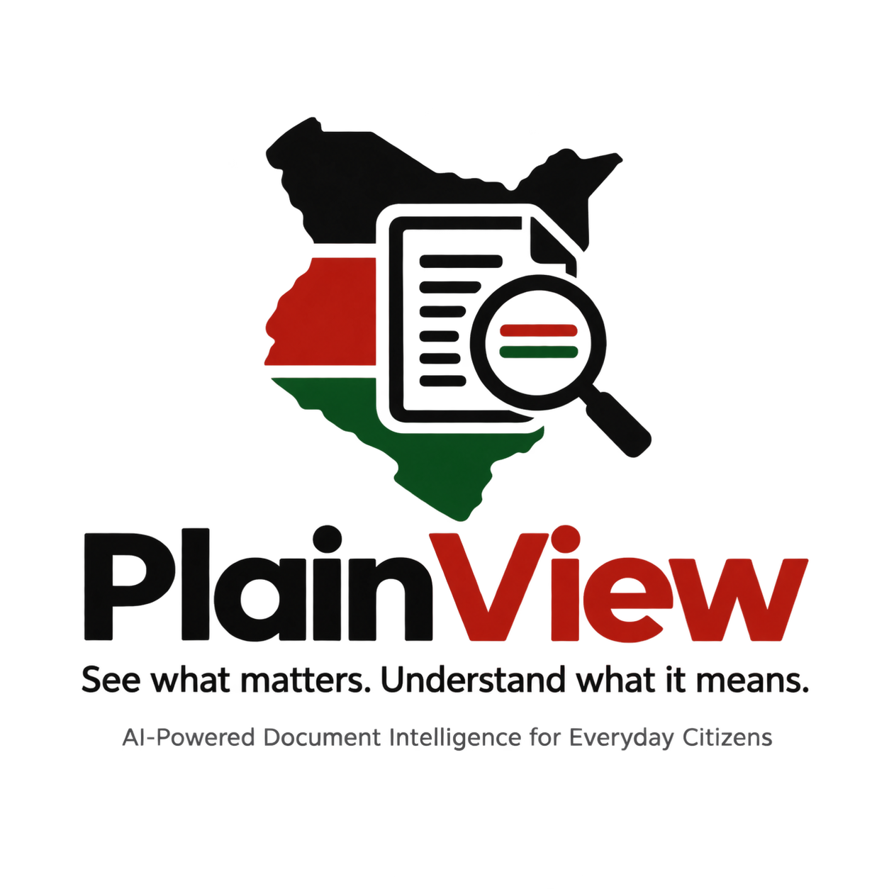

# PlainView — Local Development Setup

<p align="center">
  
</p>

This README explains how to set up and run the PlainView frontend and API locally.

## Project Structure

The repository contains two applications:

```text
plainview/
├── civiclens-web/    # Angular 22 frontend
└── civiclens-api/    # NestJS API
```

## Prerequisites

Make sure you have:

* Node.js
* Git

Check Node.js:

```bash
node --version
```

This project uses:

* **Angular 22** — `civiclens-web`
* **NestJS** — `civiclens-api`
* **pnpm** — package manager

You do **not** need to install Angular CLI or NestJS CLI globally.

---

# 1. Clone the Repository

```bash
git clone https://github.com/vicjuma/plainview.git
```

Enter the project:

```bash
cd plainview
```

---

# 2. Enable pnpm

If pnpm is not already installed, enable it through Corepack:

```bash
corepack enable
```

Verify:

```bash
pnpm --version
```

---

# 3. Setup the Angular Frontend

Move into the frontend:

```bash
cd civiclens-web
```

Install dependencies:

```bash
pnpm install
```

Start the development server:

```bash
pnpm start
```

The frontend should be available at:

```text
http://localhost:4200
```

If you need to run Angular CLI commands directly, use `npx`:

```bash
npx ng <command>
```

For example:

```bash
npx ng serve
```

---

# 4. Setup the NestJS API

Open a **new terminal** and return to the repository:

```bash
cd plainview/civiclens-api
```

Install dependencies:

```bash
pnpm install
```

Start the API in development mode:

```bash
pnpm start:dev
```

The API should normally be available at:

```text
http://localhost:3000
```

---

# 5. Run Both Applications

You need two terminals.

### Terminal 1 — Frontend

```bash
cd plainview/civiclens-web
pnpm install
pnpm start
```

### Terminal 2 — API

```bash
cd plainview/civiclens-api
pnpm install
pnpm start:dev
```

Then open the frontend:

```text
http://localhost:4200
```

The frontend will communicate with the NestJS API running on:

```text
http://localhost:3000
```

---

# Environment Configuration

Make sure the required environment configuration is available before starting the applications.

If the project contains an example environment file, copy it first:

```bash
cp .env.example .env
```

Then update the values required for your local environment.

**Do not commit secrets, API keys, passwords, or other sensitive credentials.**

---

# Useful Commands

## Frontend — `civiclens-web`

Install dependencies:

```bash
pnpm install
```

Start development server:

```bash
pnpm start
```

Build:

```bash
pnpm build
```

Run Angular CLI commands:

```bash
npx ng <command>
```

---

## API — `civiclens-api`

Install dependencies:

```bash
pnpm install
```

Start development server:

```bash
pnpm start:dev
```

Build:

```bash
pnpm build
```

---

# Troubleshooting

### `pnpm: command not found`

Enable Corepack:

```bash
corepack enable
```

Then verify:

```bash
pnpm --version
```

### Angular CLI is not installed globally

You don't need to install it globally.

Use:

```bash
npx ng <command>
```

or:

```bash
pnpm start
```

### Dependencies are missing

Run:

```bash
pnpm install
```

inside the relevant application directory.

### Port 4200 is already in use

Run Angular on another port:

```bash
npx ng serve --port 4201
```

### Port 3000 is already in use

Update the API port according to the project's environment configuration.

---

# Quick Start

After cloning the repository:

### Terminal 1 — Angular

```bash
cd plainview/civiclens-web
corepack enable
pnpm install
pnpm start
```

### Terminal 2 — NestJS

```bash
cd plainview/civiclens-api
pnpm install
pnpm start:dev
```

Open:

```text
http://localhost:4200
```
